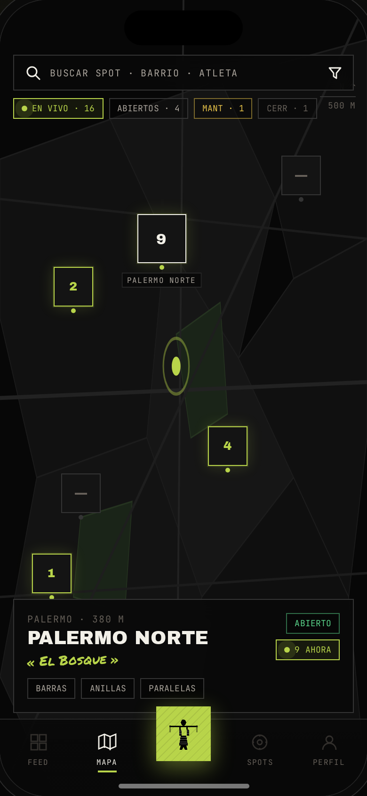
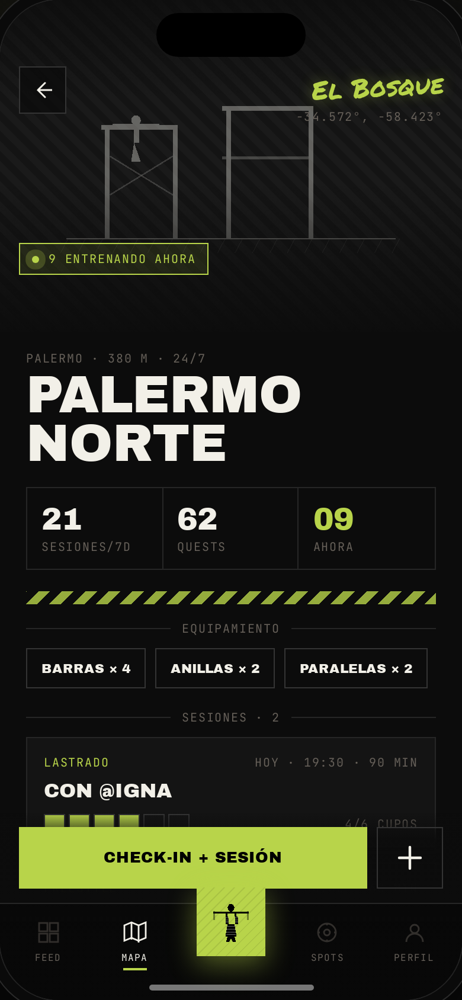
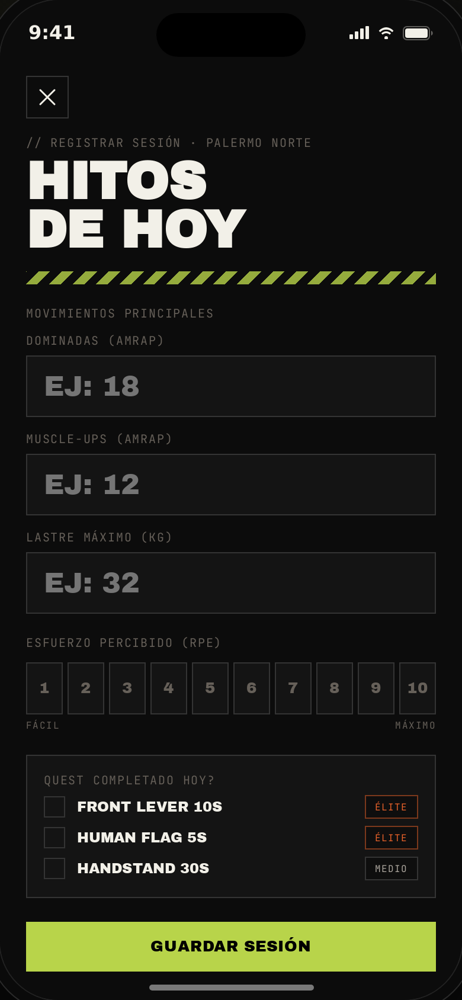
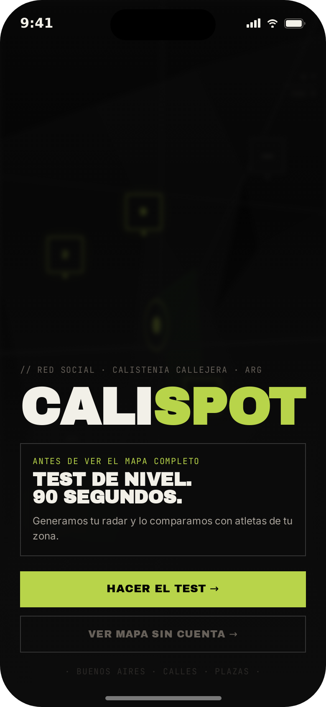
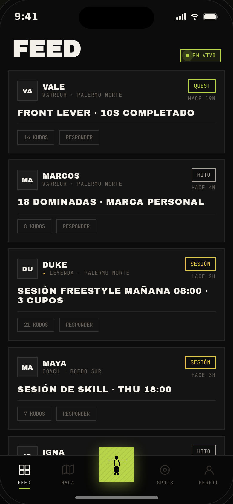
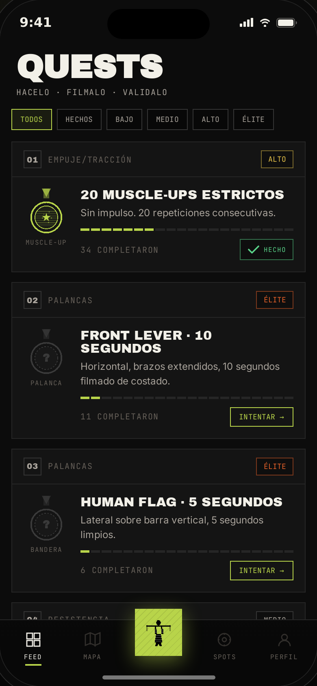
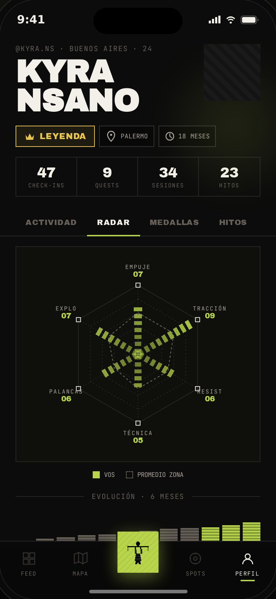
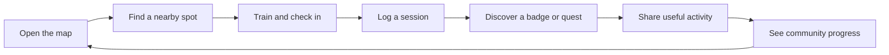

# Calispot — Outdoor Calisthenics Discovery

**An AI-assisted product and UI concept for discovering outdoor calisthenics spots and connecting training activity.**

> **Status:** product concept and interactive UI prototype. Calispot has not been released, deployed, or validated through a documented user study.

Calispot explores a simple question: how could street-calisthenics athletes find places to train and see where the local community is active? The product concept and initial direction are Daniel's. Claude Design and other AI tools assisted with UI exploration and implementation of prototype screens.

## Screens

The prototype is designed as a mobile-first experience for outdoor use: clear hierarchy, high contrast, concise labels, and large touch targets.

| Map | Spot detail | Session log |
|---|---|---|
|  |  |  |

| Onboarding | Community feed | Quests |
|---|---|---|
|  |  |  |

| Profile and training radar |
|---|
|  |

## Try the interactive prototype

Open [`prototype/calispot-standalone.html`](prototype/calispot-standalone.html) in a modern browser. It is a standalone HTML prototype; no installation, build step, backend, or account is required. Use the flow selector beside the phone mockup to move between the represented screens.

The source prototype is a large bundled HTML file. The screenshots above provide a quick visual overview without opening it.

## Product concept

Calispot is a map-first social product for the street-calisthenics community, starting with a concept for Buenos Aires. The core loop connects nearby spot discovery with in-person training, session logging, achievements, and community activity. Its primary MVP hypothesis is that seeing useful activity and progress can give athletes a reason to return the next day.

This is a product hypothesis, not a measured retention result. See the [case study](docs/case-study.md) for the concept, MVP boundaries, and limitations.

## Design approach

- **Map first:** spot discovery is the main entry point; social actions can prompt registration without blocking basic map exploration.
- **Built for outdoor context:** strong contrast, readable type, clear action hierarchy, and touch targets intended for use between sets.
- **Community over workout prescriptions:** the concept helps people find places and training activity; it is not an AI workout planner.
- **Progress with context:** sessions, spot-specific challenges, and a six-axis skill radar explore ways to make real-world training visible.

The selected tokens and visual principles are documented in [`design-system/README.md`](design-system/README.md), with the CSS tokens in [`design-system/tokens.css`](design-system/tokens.css).

## What this prototype represents

- Product/UI exploration of onboarding, map and spot discovery, session logging, feed, profile/radar, and quests.
- A local, interactive front-end demonstration with illustrative content.
- A separate design-system specification documenting a later visual direction.

It does **not** include a production mobile app, connected API, authentication, live GPS check-in, push notifications, subscription flow, or verified user research. The interactive prototype is an earlier iteration than the later design-system specification: its type treatment differs and its onboarding includes a level test that a later product decision dropped. They are presented as related design iterations rather than a fully reconciled implementation.

## Repository contents

- [`prototype/`](prototype/) — standalone interactive UI prototype.
- [`screenshots/`](screenshots/) — selected screens captured from the prototype.
- [`design-system/`](design-system/) — concise token and visual-principle reference.
- [`docs/case-study.md`](docs/case-study.md) — product framing, MVP logic, and status.
- [`scripts/capture_screenshots.py`](scripts/capture_screenshots.py) — reproducible local screenshot workflow.

## Credits and reuse

The product concept and initial direction are Daniel's. AI assistance, including Claude Design for UI exploration, was used during prototyping. This project is shared for portfolio review only. **All rights reserved; no license is granted.** Copying, reuse, or redistribution requires written permission from the author.
