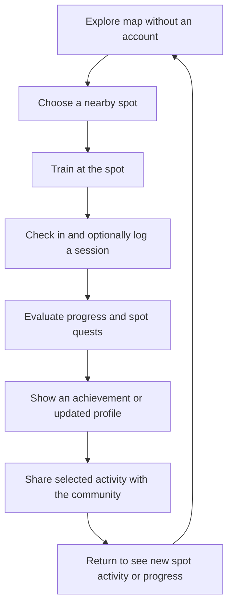

# Calispot — Product concept case study

## Overview

Calispot is a product concept I designed to help street-calisthenics athletes discover public training spots and connect those places to local training activity. The initial concept focuses on Buenos Aires and treats the map as the product's main entry point.

It is a product and UI prototype, not a launched service. I defined the concept and direction, and used AI design tools (including Claude Design) to explore and implement the UI prototype.

## Problem framing

I started from the hypothesis that useful information about outdoor bars, equipment, spot conditions, and who is training is often shared informally. Someone looking for a place to train may need to ask around or visit a spot without knowing what to expect.

Calispot explores whether a community-maintained, location-based product could make that information easier to discover. I have not validated this problem framing through a documented research study; it should be treated as a product hypothesis.

## Intended users and value proposition

- **Primary audience:** people already practicing street calisthenics who want to find nearby places and connect training to a local community.
- **Later audience:** people interested in starting who need a place and people to train with.
- **Core value proposition:** find a nearby spot, understand what is available, and see community activity connected to real places.

## Product objective and retention hypothesis

I organized the MVP concept around one behavioral question: after finding a useful spot and training there, is there a meaningful reason to return the next day?

The loop I designed connects location discovery to an in-person session, then makes participation and progress visible through session history, spot-specific quests, skill badges, and a community feed. Next-day retention is the intended product metric, not a result measured by this prototype.

## Key product decisions

### Map-first, low-friction entry

I designed basic spot discovery to work before registration. A registration prompt appears when someone tries a social feature, rather than blocking the first map view.

### Real places anchor the social layer

Spots are more than map pins: I associated equipment, recent activity, public routines, and location-specific challenges with each place. This keeps community activity grounded in where people train.

### Progress emerges from participation

I built the skill radar from earned skill badges rather than an upfront level test. Session logging and quests are meant to support visible progress without turning the product into a routine generator.

### Scope follows the retention hypothesis

I prioritized map discovery, check-in and session logging, spot routines, profile/radar, achievements, and a feed. Advanced discovery, scheduled sessions, following, Coach roles, and monetization are later-phase ideas, not implemented features.

## Experience and design direction

The product is meant to be used outdoors, between sets, in direct sunlight, and with limited attention. I therefore emphasized strong contrast, clear hierarchy, concise interface copy, large touch targets, and a touch-first interaction model. The later design-system specification records these principles and semantic tokens.

## Prototype coverage

The standalone interactive prototype covers a splash/onboarding entry, map, spot detail, training launcher, session log, feed, quests, and profile/radar. It uses illustrative UI content and is navigable locally in a browser.

The prototype is an earlier iteration than the later design-system specification: its type treatment differs, and its onboarding flow includes a level test that I later dropped in favor of starting the skill radar empty. I document these differences instead of presenting the prototype as a finished implementation of the final product direction or token set.

## Status and limitations

- The product concept, flows, visual explorations, and a standalone UI prototype are present.
- No production mobile application, backend, authentication, live GPS, push delivery, or payment integration is included.
- I make no claim of a documented user study, launch, user growth, retention result, or commercial outcome.
- The MVP scope and retention loop remain hypotheses I want to validate with local athletes.

## How I built it

I directed the product concept, scope, and design decisions. I used AI design tools (including Claude Design) to explore the UI and generate parts of the prototype, and I treated the result as a design exploration rather than validated user research or production code.
